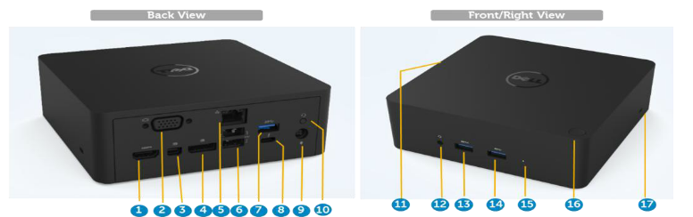

# Dell TB16 Firmware
Firmware and flashing instructions for the (now) affordable TB16 to fix some major issues. We're using three of those between home and work.
* low price — got all of them used under 50eur/piece
* Up-to-date performance—Thunderbolt 3 has the same interface and speeds as TB4, where TB4 adds mostly some security features/restrictions, whatever you want to call it.
* When fixed, works with MacBooks and all types of Windows/Linux PCs
* One of the few Docks that can deliver more than 100W on the cable
  
makes it an unbeatable bargain.

I've spent some time tweaking and fixing most issues with the Dock, especially finding different ways to flash the firmware with non-Windows and non-Dell hardware.

The Power button works only on Dell PCs, though. Is there a script somewhere that would make it work on others, too?

> [!Note]
> This procedure may also work for the peers Dell WD15, Dell TB15 (retired), and Dell TB18DC, as they share most of the components. In any case, I'm not responsible for any damages caused by these instructions.

## Firmware versions and status

The following table contains a list of known and working firmware versions. 

System | probable function | newest/available version | file | fixes? | alt flashing |
--- | --- | --- | --- | --- | ---
Synaptics MST-1 VMM3320 | DP + VGA stream processing | 03.12.002 | mst_03.12.002.cab | Glitches on screens, compatibility for MacBooks | Linux |
Synaptics MST-2 VMM3330 | mini-DP + HDMI stream processing | 03.12.002 | mst_03.12.002.cab | " "  | Linux |
Thunderbolt TB16 Cable | Intel DSL6540 'Alpine Ridge' TB bridge | 16.00 | Cable_16_00.bin | Fixes MacBook charging problem (to confirm) | Linux |
  " | " | 26.06 | Cable_26_06.bin | Unofficial update borrowed from WD15[^2], fixes "DROM data CRC32 mismatch" error and random display malfunction + Thunderbolt security update | Linux |
Thunderbolt TB16 Dock | Intel DSL6540 'Alpine Ridge' TB bridge and USB3.1 (back) | 16.00 | Dock_BME_16_00.bin | Unknown benefits | Linux |
" | " | 27.00 | Dock_BME_27_00.bin | Thunderbolt security update | Linux |
ASM USB controller |  ASM 1042A USB 3.0 host controller | 	131025_10.11_A9 | DELL_131025_10_11_A9.bin | Fixes Realtek audio noise | Windows/Linux |
 " | " | 140124_10.10_04_2 aka 131025_10.11_AB aka 131025_10.11_171 | 140124_10_10_4_2.BIN | Unofficial update, fixes S3 wakeup hang for RTL Ethernet controller | Windows/Linux |
TI 1.2.11 Port Controller 1	 | TI TB-chip firmware Cable | 01.02.11 | N/A | Updated through BIOS[^1] | none yet | 
TI 1.2.32 Port Controller 2	| TI TB-chip firmware Dock | 01.02.32 | N/A | Updated through BIOS[^1] | none yet | 
Dock EC | Embedded controller basic function, e.g. led | 01.00.00.10 | N/A | Updated through BIOS[^1] | none yet | 
Cable PD | Power Delivery controller | 00.03.12 | N/A | Updated through BIOS[^1]| none yet | 
[^1]: These are updated early on and should already be done (Dell Tool v1.00.00 - v1.00.02)
[^2]: Since the summer of 2016, Dell has shipped WD15 and TB16 docks with universal cables, supporting USB3 and Thunderbolt 3 (recognizable by the bolt and DP logo on the type C connector). It makes thus sense that they ship TB Cable firmware with the WD15.

## Flashing instructions

I will find alternative flashing methods for all files to the original Dell tool, which is limited and buggy. Also, while the original tool works ONLY with Dell PCs, these should work on all Thunderbolt-equipped systems.

### Flashing MST chips

While there is a `mst.exe` for manual flashing, that too is unreliable and buggy. For starters, it only sometimes reports the installed firmware version correctly.

> [!NOTE]
> The official update tool tends to report version such as 00.00.fd. These are actually error codes reported from the `mst.exe` and do not show if you perform a manual version check.

For a few years now, it has been possible to flash the chips also on Linux. You will need a recent `fwupd` package, e.g., shipped in Ubuntu 23.10 or newer. If you don't use Linux, you can use a Live-USB using an official Ubuntu which comes with `fwupd` installed.

Unlike what is suggested online, you MUST have a monitor connected to perform this update. This means that for MST-1, you'll need a DP or VGA connection; for MST-2, you will need a mini-DP or an HDMI screen.
To check if both MSTs are running, type the following as root or with `sudo`

```
$ fwupdmgr get-devices
```
You will see them as Dell TB16/TB18/WD15 Dock or similar.

> [!NOTE]
> If you don't see both MST devices, check cables and power or perform NVM updates first.

To install, type the following as root or with `sudo`

```
$ fwupdmgr install <cab-file>
```
> [!WARNING]
> This install may fail at the prompt but continue flashing and succeed in the background. Thus, do not remove the power to the dock for a minute or two after the command ends.


### Flashing TB16's NVM

For the two following, `Cable` and `Dock/BME`, the requirements are identical: Linux and recent `fwupd` package.

To update Thunderbolt Cable or Dock NVM, type as root/`sudo`
```
$ fwupdtool install-blob <bin-file>
```

It will prompt you to select the correct device to flash. Select `Cable` with `Cable_xxx.bin` and vice versa.

### Which NVM controller firmware to flash?

I kept the latest and the previous versions in this repository for a straightforward reason: legacy devices. The main difference between v16.xx NVMs and the v2x.xx NVMs is that the latter doesn't allow communication without a security authorization mechanism. This means legacy devices (first-gen TB3 and Thunderbolt 1 - 2 adapters) can no longer communicate with updated controllers. With the v16.xx NVM, selecting a security mode in the BIOS was still possible, optionally disabling Thunderbolt security. In short, unless you want to connect to some legacy Thunderbolt device up and/or downstream, use the latest v2x.xx firmware. It is less buggy and has a better user experience (see table above).

### Alternate NVMs (untested)

While searching for better bins, I stumbled upon some hidden images in one of the flashing tools that should not include the TB3 security code. This means that if you successfully flash the dock, you can communicate downstream with legacy devices that don't have such a function. A TB3 to TB2 adapter is one such device. Apple MACs have special firmware to make those work; PCs need a special NVM. Unfortunately, you can not flash the firmware if you have a TB security-enabled device. The flashing starts but then returns an error after a minute or so. Please report back if you manage to flash the firmware.

System | probable function | version | file | fixes? | alt flashing |
--- | --- | --- | --- | --- | ---
Thunderbolt TB16 Cable | Intel DSL6540 'Alpine Ridge' TB bridge | 16.00_nosec | Cable_16_00_nosec.bin | Disables upstream security (Laptop) and the use of legacy TB3 controllers | Linux |
Thunderbolt TB16 Dock | Intel DSL6540 'Alpine Ridge' TB bridge and USB3.1 (back) | 16.00_nosec | Dock_BME_16_00_nosec.bin | Disables downstream security, allows the use of legacy devices such as TB3 to TB1/2 adapters | Linux |

### Flashing the ASMedia USB Controller

While a [C #—coded Linux tool](https://github.com/smx-smx/ASMTool) exists, I prefer the official ASM flasher. The Thunderbolt controller extends the PCIe bus where the controller is connected and allows us to use the standard PCIe flashing tool. Use the `exe` found in `tools/ASMedia_win` of this repos on Windows or a Windows-to-go disk made, e.g., with Rufus, and execute it with the binary file copied into its folder.

If you use the `cmd` prompt and enter the directory, you can check the installed version with `/version` or force overwrite using the `/f` flag.
```
> asm.exe /version
```
The tool will not flash if the bin is older or equal to the installed one and exits (unless run with `/f`).
If there is more than one bin file in the directory, it will take the first one using ASCII order, e.g., numbers before letters.

> [!NOTE]
> The Dell firmware updater checks only the last digits of the firmware version and may thus think the firmware is older. However, `asm.exe` is invoked and does not update.

## Official Flashing tools

If you prefer to use the official Flash tool, you can find a copy in the `official` folder. However, it works only on Dell laptops. If your device doesn't have the controller, EC, and PD updates listed above, you may need to flash with version 1.00 and then 1.02 first. These install a Bios-based update file that executes an update at Bios start.

Furthermore, Dell messed up the firmware packaging for the 1.05. The Dock companions of that generation, the WD15, and TB18, got a new `Cable.bin` and were released the same day. You can use the WD15s flasher to update the `Cable.bin`.

# The Dell TB16 Dock

## What's there and what works (also non Windows)



### 1. 	HDMI
This HDMI 1.4a standard port supports up to 4K (3840x2160) resolution at 24/30Hz. I tested QHD (2560x1440@60Hz). If MST and Cable NVM are not up to date, it may show black, not always wake up, or not work at all. According to Dell, it does not support HDCP, while kernel output says `HDCP version: HDCP1.4`. To be checked

### 2. 	VGA
Standard traditional VGA, up to Wide-Full-HD 1920 x 1200 @ 60. Works, tested Full-HD 1920 x 1200 @ 60Hz

### 3. + 4. 	DisplayPort (DP) and mini-DisplayPort (mDP)
These ports are v1.2 compliant and typically support Full-HD 3840 x 2160 @ 60Hz, and Daisy Chaining. Mini-DP or DP may casually stop working without the latest Cable NVM. Again, Dell says it does not support HDCP, while kernel output says `HDCP version: HDCP1.4`. To be checked

### 5. 	RJ45 Gigabit Ethernet
Generic RTL8153 Gigabit Ethernet controller. No surprises. However, it may have issues waking up from deep sleep (suspend) if the ASMedia USB controller firmware is not up-to-date. The problem can also be solved by detaching and re-registering the controller on the PCI bus via script.

### 6. 	USB 2.0 (2 ports)
"Slow"-speed port generally intended for input devices such as mouse, keyboard, trackpad, Smart-card readers, etc. No issues

### 7. 	USB 3.0
SuperSpeed USB is ideal for, e.g., the monitors USB-HUBs or USB-NAS. No problems

### 8. 	Thunderbolt 3 (USB Type-C)
Limited (intended, reduced lanes by upstream) Thunderbolt is available for, e.g.,  Daisy-chain DP via tunneling onto Multiple USB-C monitors or USB 3.1 Superspeed devices. You can create an IP over the Thunderbolt tunnel and thus have multiple Gb speed transfers over the virtual ethernet adapters, which is ideal for some compute-backend connections. In particular configurations, monitors may reach 5120 x 2880 @ 60 Hz for a single display. DP functionality not tested.

### 9. 	7.4 mm DC-in power
According to the manual, the Dock does not accept 130W power supplies. However, viable power options are 130W, 180W, or 240W. The power supply limits the energy that can be supplied to the laptop. Unless you have a specific Dell Model, you should not need the 240W power supply, as the 100W limit can only be waived by Dell proprietary protocols. Power limits are 40-60W with a 130W PSU, 60-90W with a 180W PSU, and up to 130W with a 240W PSU. The Dock identifies the connected power supply through a [one-wire](https://hclxing.wordpress.com/2014/02/06/hacking-the-dell-laptop-power-adapter/) protocol.

### 10. 	3.5 mm Speaker-out
It works well but may be too sensitive to RF interference, such as mobile phones (missing shielding). On MACs, you need to edit the advanced MIDI/Audio device config to add the second (either front or back) stream to the outputs in the quick bar at the top right. Look for a quick guide online, as it seems to be a common problem.

### 11. 	Dell Docking station connector 
Dell Proprietary connection to USB Type 3 port on PC. The light does not go on with, e.g., MacBooks, but it works and charges. Some users say the TB16 will only deliver up to 60W (20V @3A) for non-Dell systems. Unfortunately, this seems true and applies to new Dell systems, too. The Dock negotiates over USB-PD the quantity it can deliver to the desktop, and when attached, it only reports a programmable power supply (PPS) of 3A max current and 5 to 19.5V (the Dock's power supply voltage).

(These examples use Linux package `lmsensors` and command `sensors`)
```
Adapter: ISA adapter
in0:          19.50 V  (min =  +5.00 V, max = +19.50 V)
curr1:         3.00 A  (max =  +3.00 A)
```
Dell likely uses proprietary information in the extended information PDO of USB-PD to identify its systems and deliver more than 3A. Even if I attach a new Dell system, it won't report more than 3A max. By the way, 3A is the maximum limit USB-C can deliver with default specifications. For more current, you need electronics and wiring that support it. It makes sense that Dell limits it to 3A.

If I connect an Apple adapter, I get the following output.
```
Adapter: ISA adapter
in0:          20.00 V  (min =  +5.00 V, max = +20.00 V)
curr1:         3.00 A  (max =  +4.70 A)
```
However, in my case, where the laptop doesn't require more than 3A, 60W should be enough for most standard Laptops/Ultrabooks (Non-gaming, etc.). I also tested it with my wife's MacBook Pro 16" with an M2 Max top-notch CPU, and she uses it regularly with no issues. The `Calble PD` firmware is likely responsible for this negotiation mechanism -- assuming that PD stands for power delivery, as in USB-PD. I will investigate!

### 12. 	Headset Jack
The front jack is helpful for wired earplugs and a quick Video Call. Linux works without a problem. Since Ubuntu LTS 24.04, it also detects if a jack is not plugged in and removes it from the output list. 

### 13. 	USB 3.0 w/PowerShare
This valid quick-access front port has always-on power. It is ideal for charging phones or plugging hungrier devices. It also works at full power without a laptop being connected, so you can draw 7.5W with or without registering to the hub. I also use it to charge random stuff around the house, which doesn't even use the USB data lines. 

### 14. 	USB 3.0
As above, but without always-on power and a typical max of 4.5W, the device must register first to pull the power.

### 15. 	Power Adapter LED

### 16. 	Dock Button
Works with Dell, the same as the power button. No luck otherwise.

### 17. 	Kensington lock slot


## Video outputs and resolutions

The device has three video sources: MST-1, MST-2, and the TB3 port on the back. Each can deliver 3840x2160(4k) @ 60Hz without any particular configuration. While chip-wise 3x4k @ 60Hz is possible, upstream bandwidth limits cap such a configuration to 1x @ 60Hz + 2x @ 30Hz (to be verified). It needs to be clarified how using the TB3 port for video affects the MST performance. The possible graphics mode table lists only a single-screen configuration for USB-C, nothing for the Thunderbolt mode. (I will test as soon as I have a USB-C/TB3 monitor)

The two MST devices serve two ports each: DP and VGA for MST-1 and mini-DP and HDMI for MST-2. If both ports are in use, the above limits either halve in frequency, e.g., 3840x2160@30Hz, or reduce the resolution to 2560x1440@60Hz. VGA may be limited to 2048x1280. However, due to bandwidth and software/graphics card limits, there may be at most three monitors in operation simultaneously. Special modes are possible with proprietary Dell hardware.

Summing it up, if your graphics adapter supports it, a laptop + dock can support up to 4 screens (panels). On `i915` compatible systems, you can check how many displays your card supports with
```
grep "CRTC" /sys/kernel/debug/dri/<PCI-address>/i915_display_info
```
Where `<PCI-address>` is the address shown using `lspci`, escaped, e.g., `0000\:00\:02.0`.
